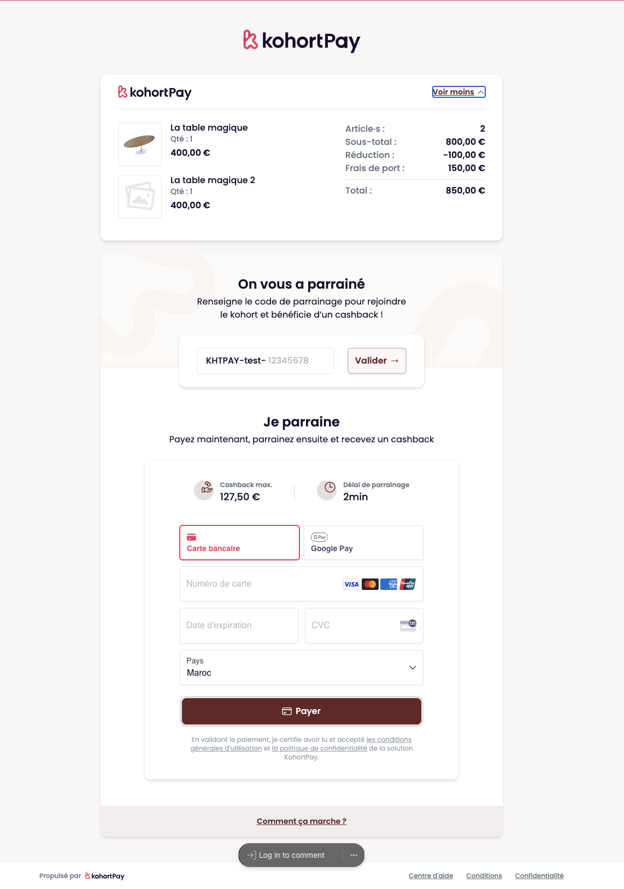

# KohortPay Checkout


## Project Overview

The KohortPay Checkout is a robust payment platform designed to facilitate seamless transactions by integrating referral mechanics directly into the checkout process. This unique approach revolutionizes the shopping experience by encouraging teamwork and social engagement, turning every customer into a brand ambassador. KohortPay supports two modes: live and test mode, ensuring smooth development and testing workflows.

You can see the preview:



### Key Features

- **Pay, Refer & Save**: Allows users to earn cashback by referring friends, making shopping fun and rewarding.
- **Social Checkout**: Integrates referral rewards at the payment step to boost customer acquisition and conversion rates.
- **Gamification**: Turns payments into an interactive and social experience to enhance performance.
- **Analytics**: Provides real-time performance optimization through data-based AI tools.

## Table of Contents

- [Getting Started](#getting-started)
- [Installation](#installation)
- [Development](#development)
- [Build and Deployment](#build-and-deployment)
- [Environment Variables](#environment-variables)
- [Linting and Formatting](#linting-and-formatting)
- [Directory Structure](#directory-structure)
- [Scripts](#scripts)

## Getting Started

First, run the development server:

```bash
pnpm run dev
```

Open [http://localhost:3000](http://localhost:3000) with your browser to see the result.

You can start editing the page by modifying `app/page.tsx`. The page auto-updates as you edit the file.

This project uses [`next/font`](https://nextjs.org/docs/basic-features/font-optimization) to automatically optimize and load Inter, a custom Google Font.

## Installation

To set up the project locally, follow these steps:

1. **Install Node.js (version 20)**:

   ```sh
   brew install node@20
   ```

2. **Install pnpm globally**:

   ```sh
   npm install -g pnpm
   ```

3. **Install VSCode Extensions (optional but recommended)**:

   ```sh
   code --install-extension bradlc.vscode-tailwindcss
   code --install-extension dbaeumer.vscode-eslint
   code --install-extension eamodio.gitlens
   code --install-extension esbenp.prettier-vscode
   code --install-extension ms-azuretools.vscode-docker
   code --install-extension ms-vscode-remote.remote-containers
   code --install-extension ms-vscode.makefile-tools
   code --install-extension ms-vsliveshare.vsliveshare
   code --install-extension PKief.material-icon-theme
   code --install-extension Prisma.prisma
   code --install-extension yoavbls.pretty-ts-errors
   ```

4. **Copy environment variables**:

   ```sh
   cp .env.example .env.local
   ```

5. **Install dependencies**:
   ```sh
   pnpm install
   ```

## Development

To start the development server:

```sh
pnpm run dev
```

This command will start the development server and you can view the application at `http://localhost:3000`.

## Build and Deployment

To build the application for production:

```sh
pnpm run build
```

This will compile the project and output the static files in the `.next` directory. To start the application in production mode:

```sh
pnpm run start
```

## Environment Variables

Ensure that your `.env.local` file includes the necessary environment variables for the project to run correctly:

```env
# KohortPay
KOHORTPAY_API_URL=http://localhost:3001
KOHORTPAY_MASTER_KEY=master_key
NEXT_PUBLIC_KOHORTPAY_MY_URL=https://my.kohortpay.dev

# Stripe
NEXT_PUBLIC_STRIPE_PUBLISHABLE_KEY=stripe_publishable_key
STRIPE_SECRET_KEY=stripe_secret_key

# Stripe TEST mode for PRODUCTION
NEXT_PUBLIC_STRIPE_PUBLISHABLE_KEY_TEST=stripe_publishable_key
STRIPE_SECRET_KEY_TEST=stripe_secret_key
```

## Linting and Formatting

This project uses ESLint and Prettier for linting and formatting the codebase.

- **Lint the code**:

  ```sh
  pnpm run lint
  ```

- **Format the code**:
  ```sh
  pnpm run format
  ```

## Directory Structure

The project structure is organized as follows:

```
.
├── .next/                  # Next.js build output
├── node_modules/           # Node.js modules
├── public/                 # Public assets
│   ├── .well-known/        # Well-known directory for security and verification files
│   ├── fonts/              # Font files
│   ├── images/             # Image assets
│   │   ├── backgrounds/    # Background images
│   │   ├── icons/          # Icon images
│   │   ├── logos/          # Logo images
│   │   └── placeholders/   # Placeholder images
│   └── scripts/            # Public scripts
├── scripts/                # Custom scripts
├── src/                    # Source files
│   ├── app/                # Main application files
│   │   ├── _components/    # Common components
│   │   │   ├── api/        # API related functions
│   │   │   ├── locales/    # Localization files
│   │   │   ├── settings/   # Settings and configurations
│   │   │   ├── types/      # TypeScript types
│   │   │   ├── ui/         # UI components
│   │   │   └── utils/      # Utility functions
│   │   ├── c/[id]/         # Dynamic routes for checkout
│   │   │   ├── _sections/  # Page sections
│   │   │   ├── _checkout-form/
│   │   │   │   ├── _order-summary/
│   │   │   │   ├── _success-page/
│   │   │   │   ├── back.tsx
│   │   │   │   ├── customer-informations.tsx
│   │   │   │   ├── heading.tsx
│   │   │   │   ├── how-it-works.tsx
│   │   │   │   ├── join.tsx
│   │   │   │   ├── order-summary.tsx
│   │   │   │   ├── settings.tsx
│   │   │   │   ├── success-page.tsx
│   │   │   │   ├── terms.tsx
│   │   │   ├── banner-mode.tsx
│   │   │   ├── checkout-form.tsx
│   │   │   ├── footer.tsx
│   │   │   ├── page.tsx
│   │   │   └── error.tsx
│   │   ├── favicon.ico     # Favicon
│   │   ├── globals.css     # Global CSS
│   │   ├── layout.tsx      # Layout component
│   │   └── page.tsx        # Main page
├── .env.example            # Example environment variables
├── .env.local              # Local environment variables
├── .eslintrc.js            # ESLint configuration
├── .gitignore              # Git ignore file
├── .prettierrc             # Prettier configuration
├── Makefile                # Makefile for automation
├── next-env.d.ts           # Next.js environment types
├── next.config.js          # Next.js configuration
├── package.json            # Project dependencies
├── pnpm-lock.yaml          # pnpm lock file
├── postcss.config.js       # PostCSS configuration
├── README.md               # Project README file
├── tailwind.config.js      # Tailwind CSS configuration
└── tsconfig.json           # TypeScript configuration
```

## Scripts

Here are the scripts defined in the `package.json`:

- `dev`: Starts the development server.
- `build`: Builds the application for production.
- `start`: Starts the application in production mode.
- `lint`: Lints the codebase using ESLint.
- `format`: Formats the codebase using Prettier.
- `cypress:run`: Runs Cypress tests.
